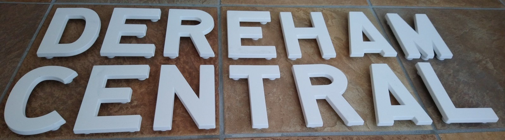
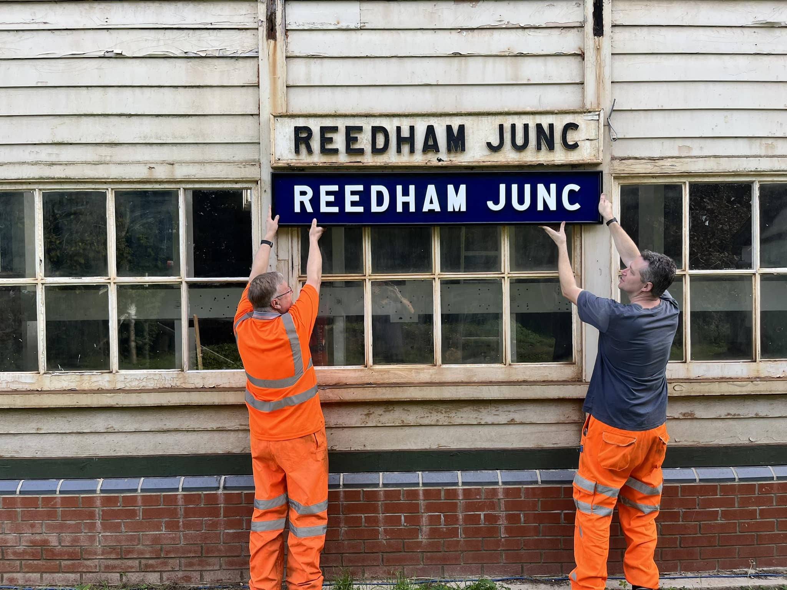
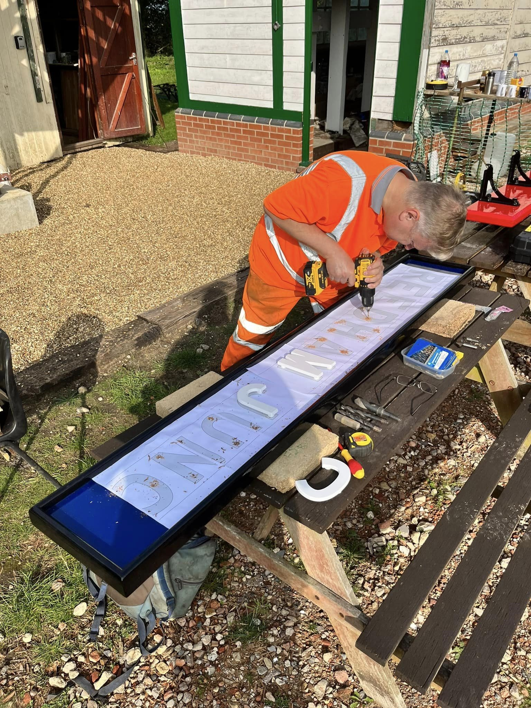

# osb-3d-letters

3D files of capital letters in a prototypical signal box name board font.

These files, created and kindly shared by Maurice Gifford, are based on a font drawn by Owen Stratford.

The 3D STL files include stand-offs with pilot holes to be screwed into with self-tapping screws from a back board. Please see the photos below for reference.
In addition, there are SVG vector files for each capital letter, with holes in place, suitable for printing hole-marking sheets for back boards, or even laser-cutting or milling letters from wood.

